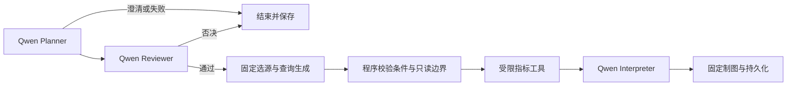

# V1 Qwen 多 Agent 协作补全

用户在确定性 V1 固化后明确要求以 medium 补全真实模型协作。`v0.2.0` 保留为旧确定性版本；当前分支后续提交提供以下生产路径，不移动旧标签、不推送远端。



三个 Agent 复用同一 Qwen Flash 模型，但分别使用独立系统指令、输入上下文与输出契约，每个都实际调用模型。LangGraph 负责交接及条件路由：严格可解析的原始条件由程序绑定，其他计划由 Reviewer 否决或批准；Interpreter 只在工具返回有效结果后运行。这是有界顺序协作，不是三个不同模型、并行辩论或任意工具自治。

Planner 理解自然语言并提出受限规范问题；程序已能完整解析的原始条件直接绑定，不接受模型改写。无法严格解析的自然语言计划经独立 Reviewer 对照原问题及父条件审核，之后仍须通过固定查询白名单。模型语义理解仍可能出错，Reviewer 不是正确性证明；用户应核对页面条件。已知危险操作/模糊日期可零调用澄清。

Interpreter 读取计划、复核决定和程序生成的事实字典，选择事实引用与顺序；页面逐字渲染已验证事实，不能由模型自由生成数值或因果结论。每期分组事实最多传前五组，解释只能选择1至6个合法且不重复的引用，总结果与图表不受该解释上下文上限影响。无效 JSON、未知引用、预算/网络失败全部明确失败；若工具已经完成，保留部分结果，不自动重试、不静默切回确定性模式。

## 运行

已有项目保留原密钥和费用账目，不需要安装依赖：

```powershell
cd "C:\Users\Kobe Bryant\Agent Project"
$env:ECOMMERCE_ANALYSIS_ORCHESTRATOR = 'v1'
.\.venv\Scripts\python.exe -m devtools.run_ecommerce --qwen
```

浏览器 http://127.0.0.1:5567。先“开始独立分析”，试问“帮我看看2018年一月份卖了多少钱，有多少笔已交付订单”；成功后“基于此分析继续追问”，输入“按地区分组销售额最高前3”。页面展示规划、复核与核验说明状态。已有历史结果不会自动重新调用模型；旧确定性节点不会冒充新的三 Agent 成功记录。

“销售量/销量”不会自动等同于订单数或金额，当前不支持商品件数；这类输入在模型调用前明确澄清。独立查询需写明期间，例如“2018年1月按地区分组订单数最高前5”。只有通过“基于此分析继续追问”关联父分析，才能省略并继承日期；请按实际需要选择指标和期间。

不带 `--qwen` 仅恢复已有结果，新任务显示 MODEL_DISABLED。启动器不读 dotenv，密钥只来自服务端进程/HKCU。V0 默认和两调用上限不变；V1 每任务最多三次模型调用、每次预留 0.02 元，共用既有 10 元累计预算、输入 16384 字节/输出 768 token、60 秒协作式截止与固定 worker 15 秒限制。账目 stage 为 V1-team，失败与未知费用记录保留。

## 验证与限制

本次相关离线后端回归 277 项、前端 15 项、TypeScript 和生产构建通过；真实 Edge → Flask → 三次 Qwen → 固定工具 → 工作区完成自然语言汇总和父分支 Top N 两个任务。同 ID 重复提交零新增模型调用，实际停止服务后不启用模型重启恢复成功，页面错误 0。原始 CSV 独立复算总计与地区 Top N 相同。完整细节保留在 ignored `docs/verification/V1-team-*.json`，不分发业务结果和逐次账目。

调试中两次规划改写被拦截为澄清，一次解释引用不合法导致 failed 且保留真实部分结果，均未绕过校验或删除记录。成功父任务未重复付费。初始浏览器等待脚本失败在调用前发生，零费用。最终两项成功与失败证据分别保留，不把首次失败写成全程一次成功。

保留固定三指标、单快照、本机单用户、容量限制及数据许可边界，不扩展商品/支付/退款/利润、RAG、任意 SQL/Python或生产部署。历史 V1-14—16 报告描述旧确定性路径；当前模型行为以本文为准。恢复和回退详见 [运行指南](ECOMMERCE_V1.md)。

## 2026-09-18 V1 收尾验收

R01—R08 当前出口以 [V1-team-summary.json](validation/V1-team-summary.json) 为准。315项后端、15项前端、类型和构建通过。R04真实演示与R05独立复算/恢复通过。R06首批V1为14/20成功，保留六个失败；修复Reviewer日期重解释及Interpreter分组引用后，新批次20/20成功，另有2个定点样本成功。旧V0为20/20。新V1 P95为5482.684ms，旧V0为6210.874ms；补跑时段不同且样本小，不宣称性能或可靠性优势。

Reviewer必须先通过输出schema校验；对严格明确条件的合法澄清记录原决定后以程序条件为准，不能擅自将单月猜成全年。分组切换清除旧排序/Top N，日趋势按绝对日期而非跨月配对差值展示。

累计247次调用，已知估算0.04992810元，预留4.89元；历史2笔未知usage仍保守预留。实际账单不由该估算替代。失败、账目和私有验收目录保留，不发布原始业务结果。当前模型标识为qwen-flash别名，未取得provider不可变版本，不能保证未来别名行为相同。当前封口只覆盖本机单用户，V2尚未实现。
